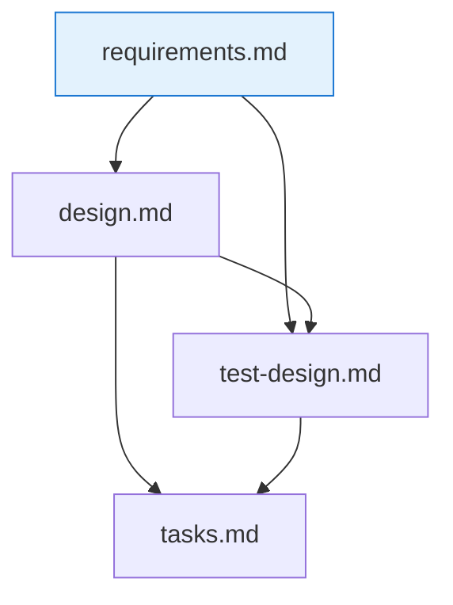
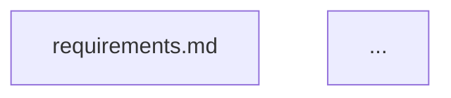
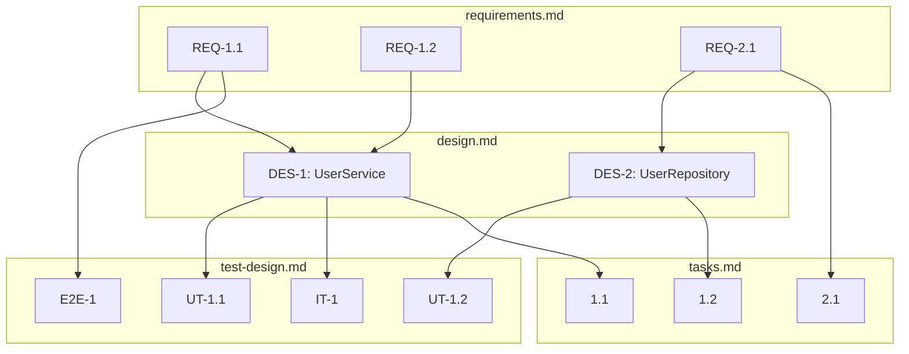
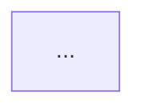

# Spec Graph (Dependency Visualization)

Generate a **mermaid diagram** of the dependency graph between spec files in `.spec-workflow/specs/{spec-name}/`. Two levels are supported:

- **file level** (default) — nodes are files (`requirements.md`, `design.md`, `test-design.md`, `tasks.md`), edges are `depends_on` relations
- **id level** — nodes are identifiers (`REQ-N.M`, `DES-N`, `UT-N.M`, ...), edges come from `depends_on[].refs`

This is the visual complement to `/spec-verify` (textual integrity check) and `/spec-impact-analyze` (change propagation). The diagram is **read-only** — the skill never modifies spec files.

## When to Use

- Before starting implementation: get a bird's-eye view of what depends on what
- During design review: confirm the spec structure is reasonable
- In PR descriptions: paste the mermaid diagram so reviewers can see the spec relationships
- When onboarding someone to an existing spec: the graph is faster to read than four separate markdown files

## Scope Distinction (vs Wave 1 Architecture Diagram)

- **Wave 1 Architecture diagram** (in `design.md`): source code module structure (how the runtime code is organized)
- **`/spec-graph`** (this skill): spec document structure (how the *documentation artifacts* depend on each other)

The two are independent views of different graphs. `/spec-graph` does not replace Wave 1.

## Prerequisites

1. `.spec-workflow/specs/{spec-name}/` exists
2. Ideally, spec files have `depends_on` frontmatter per `spec-dependency-graph.md` SD2. Files without frontmatter are rendered as isolated nodes with a `legacy` style

## Inputs

- **spec name** (kebab-case, required)
- **level** (optional; `file` or `id`; default `file`)
- **output** (optional; one of):
  - `stdout` (default) — print the mermaid block in chat
  - `file:<path>` — write the diagram as a standalone `.md` file (the user supplies the path; recommended: `.spec-workflow/specs/{spec-name}/reviews/graph-{YYYY-MM-DD-HHMM}.md`)
  - `inline` — return only the mermaid fenced block without surrounding prose (useful when embedding in PR descriptions)

## Process

### 1. Discover Files and Frontmatter

List and read:

- `requirements.md`
- `design.md`
- `test-design.md`
- `tasks.md`

For each that exists:

- Parse YAML frontmatter. Record `spec_id`, `phase`, `depends_on`
- If frontmatter is absent, record the file as `legacy` (no dependency edges known)

### 2. Build Graph Data

#### file level

- Nodes: one per existing file (`requirements`, `design`, `test-design`, `tasks`)
- Edges: for each entry in `depends_on`, draw edge from **downstream file** to **upstream file** (or upstream → downstream — see step 3 for direction)

#### id level

- Scan each file body for ID headings per `spec-dependency-graph.md` SD1:
  - `### REQ-N:` + `<!-- REQ-N.M -->` comments → REQ nodes
  - `### DES-N:` / `### MOD-N:` / `### API-N:` → DES/MOD/API nodes
  - `#### UT-N.M:` / `### IT-N:` / `### E2E-N:` → UT/IT/E2E nodes
  - `- [ ] N.M ...` list items → task-id nodes (leverage the task-parser.ts convention)
- Edges from `depends_on[].refs`: for each ref, draw edge from the downstream file's IDs that reference it → upstream ID
  - For id-level granularity, also use tasks.md `_Requirements:` to connect individual tasks to REQ IDs
  - And use test-design.md's Requirements-Test Traceability Matrix to connect REQ → UT/IT/E2E

### 3. Render Mermaid

Use **top-down (`graph TD`)** layout with upstream → downstream direction. Edge direction: **upstream → downstream** (arrow points in the direction changes propagate).

#### file level example



If any file is `legacy` (no frontmatter), apply the `legacy` class so it renders with dashed borders:



#### id level example



At id level, cluster nodes under `subgraph {file}` blocks so the layout remains readable even with many IDs. If a single file has more than ~25 IDs, warn in the output that the id-level graph may be too dense and suggest file-level mode.

### 4. Write or Print

Based on the `output` parameter:

- `stdout` (default): print a section like the one below in chat
- `file:<path>`: write the same content to `<path>` (create parent directories if needed). Do not overwrite existing files without the user's explicit confirmation
- `inline`: return only the fenced mermaid code block, no prose

Output template (for `stdout`). The embedded mermaid block uses 3 backticks; the outer template is shown here with 4 backticks so the nested fence does not prematurely close:

````markdown
# Spec Graph: {spec-name} ({level} level)

**Generated**: {YYYY-MM-DD HH:MM}
**Frontmatter coverage**: {N of 4 files have frontmatter; legacy files appear with dashed borders}



## Legend

- Solid box: file or ID with frontmatter / explicit declaration
- Dashed box: legacy (no frontmatter — dependencies not statically known)
- Arrow direction: upstream → downstream (changes propagate in arrow direction)

## Notes

- For interactive navigation, paste this block into a mermaid-aware viewer (GitHub preview, mermaid.live, VSCode mermaid extension).
- To drill into ID-level relations, re-run with `level=id`.
- If a file appears isolated, either the upstream reference is missing or frontmatter has not been added yet — run /spec-verify to confirm.
````

### 5. (Optional) Suggest Next Actions

If legacy files (no frontmatter) are detected, append:

> **Suggestion**: {N} file(s) shown with dashed borders lack frontmatter. To include them in the dependency graph, add `depends_on` frontmatter per `.claude-plugin/rules/spec-dependency-graph.md` SD2.

If the graph shows a file with **no incoming or outgoing edges** (but frontmatter is present), append:

> **Suggestion**: {file} has no declared dependencies. Run /spec-verify to check whether `depends_on` is missing expected upstream references.

## Rules

- **Read-only** — never modifies any spec file
- **Legacy-tolerant** — files without frontmatter appear as isolated `legacy`-class nodes, not as errors
- **No gating** — the graph is informational; no workflow is blocked
- **Deterministic layout** — always use `graph TD` with upstream at the top so repeated runs produce comparable diagrams
- **Cluster id-level nodes** under `subgraph {file}` so the visual mapping back to source files is immediate
- **Warn at scale** — if id-level output would exceed ~100 nodes total, warn and suggest file-level mode instead (mermaid renders become unreadable beyond that point)
