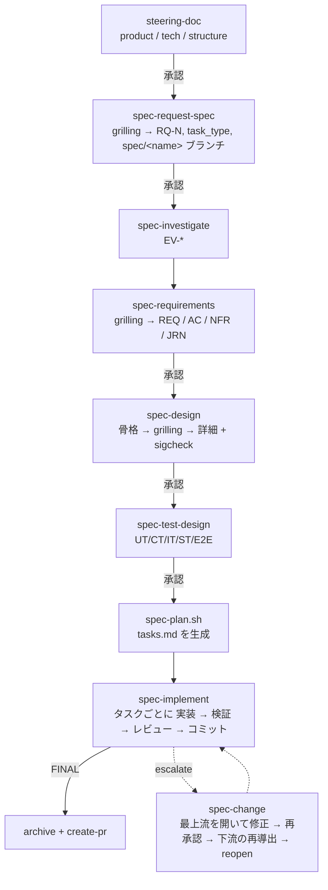

# spec-workflow-mcp プラグイン フロー(v2)

`.claude-plugin/` が提供するフロー・agent・skill・hook・script の全体像。文書の文法は `.claude-plugin/rules/doc-format.md`、テストの層は `rules/test-taxonomy.md`、判定は `rules/verdict.md` が唯一の定義で、このファイルはその索引にあたる。

## 1. 設計の核

| 原則 | 仕組み |
|---|---|
| 1 つの事実を所有する文書は 1 つだけ。他の文書は ID で参照し、書き写さない | 文書の文法と決定的 lint(`spec-lint.sh`、L01-L26) |
| tasks.md は書かずに生成する | `spec-plan.sh` が design / test-design とコミット trailer から導出する |
| 上流が再承認されると、下流の承認は自動で失効する | 承認台帳(sha256 と上流ハッシュ)。request の前提条件・フック・コミットゲートの 3 か所で止める |
| design のシグネチャは、承認前にコンパイラで確かめる | `spec-sigcheck.sh` が stub の crate を生成して `cargo check` を実行する |
| 実装はシグネチャとテストを勝手に変えられない | RED で Interfaces をそのまま写して stub にし、以後はゲート G4 / G5 / G6 で固定する |
| コミットの経路は 1 本、判定者は 1 人 | `spec-git.sh`(G0-G9)。コードをコミットし、判定を下すのは review-worker だけ |

## 2. フロー

- 各文書は spec-author が書き、`/spec-review` を通してから承認を依頼する。`/spec-review` の中身は、lint(design は sigcheck も)→ spec-reviewer → 修正で、最大 3 回。
- steering は spec と層が違うので `/spec-review` を通さない。steering-doc が 3 文書を書き終えてから、lint → steering-reviewer → 修正を最大 3 回行う。観点は product との整合、プロジェクト全体に当てはまる記述か、文書間の整合、抽出モードでのコードとの一致。greenfield の値は計画値なので、ライブラリやビルドツールの挙動は P0 の実行で確かめ、レビューでは問わない。
- 承認はダッシュボードでだけ行う。`/check-approval` は確認を 1 回だけ行い、承認されていれば文書をコミットして、固定の遷移表で次の段階へ進む。
- 人が介入するのは次の 3 か所だけで、それ以外では止まらない。
  - 承認
  - grilling(request-spec・requirements・design 骨格の各 Phase で、spec-author を起動する前に行う判断の確定。手順は `rules/grilling.md`)
  - escalate
- grilling は、判断を依存関係の木に並べ、前提が確定した問いだけを 1 ラウンドにまとめる。各ラウンドはまず JEV に `scripts/spec-grill-jev.sh`(jevcli)で答えさせ、閾値を満たさなかった問いだけを推奨回答付きでユーザーに尋ねる。jevcli が無いか失敗したときは全問をユーザーに尋ねる。事実は evidence や Explore で調べ、ユーザーには尋ねない。確定した判断は `DECISIONS` として spec-author に渡し、spec-author は渡されていない判断を自分で決めずに `open_decisions` として返す。

## 3. 文書と事実の所有

| Phase | 文書 | 所有する事実 | 承認 |
|---|---|---|---|
| S | steering/product・tech・structure | 目的・技術スタック・テストコマンド・品質コマンド・テスト配置・Wiring Files・Health・Sigcheck | 要 |
| 0 | request-spec | 要求 `RQ-N`、task_type、スコープ外 | 要 |
| 0.5 | evidence/ | 根拠 `EV-{cat}-NNN`(コードは `path:Lx-Ly@<commit>`、ライブラリは `crate:<name>@<version>:<item>`) | 不要 |
| 1 | requirements | `REQ-N` / 受入基準 `REQ-N.M` / `NFR-N` / `JRN-N` | 要 |
| 2 | design | `DES`(Files / Layer / Phase / Interfaces)、`MOD`(型・Raises)、`API`、`TST`、`DEP`(Contract)、`TOOL`、`KD` | 要 |
| 3 | test-design | `UT-{DES}.M` / `CT-{DES}.M` / `IT` / `ST` / `E2E`(型や関数には `` `MOD-N:Type` `` / `` `DES-N:fn` `` の限定参照で触れる) | 要 |
| 4 | tasks.md | 生成物(手で編集すると guard-edit が拒否し、`spec-plan.sh --check` が検出する) | 不要 |

## 4. 承認台帳

承認台帳の契約は `contract/approval-ledger-v1.md` にある。TS の MCP サーバー、Bash の `spec-state.sh`、将来の specrail(Rust)は、共有フィクスチャ `contract/fixtures/` で同じ判定を返す。

- **台帳の中身**: 承認した本文の sha256 と、その時点の上流の sha256 を記録する。
- **request の前提条件**: 上流が承認済みで、かつ未変更であること。request-spec の場合は、さらに steering が承認済みであること。
- **approve の条件**: 依頼した時点から本文が変わっていないこと。
- **文書の状態**: `pending` / `unapproved` / `modified` / `stale` / `approved` の 5 つ。4 文書がすべて `approved` のときだけ実装に入れる。

## 5. 実装ループ(`spec-implement`)

オーケストレーターは文書の本文を読まない。`spec-next.sh` の出力と、各 agent の最終 JSON だけで進める。agent は 1 つずつ起動する(guard-agent のロック)。

| タスク | 実装 | 検証(読み取り専用) | 判定・コミット |
|---|---|---|---|
| `P0-TOOLS` | `spec-tools-check.sh` | — | `spec-git.sh record` |
| DES(logic / types) | impl-worker | unit-test-engineer | review-worker |
| DES(ui) | impl-worker | frontend-test-engineer | review-worker |
| DES(adapter / wiring / config)、TST | impl-worker / integ-test-worker | — | review-worker |
| `P{n}-IT` / `ST` / `SMK` | integ-test-worker | integ-test-auditor | review-worker |
| `P{n}-REFACTOR` | impl-worker(テスト変更なし) | unit-test-engineer | review-worker |
| `P{n}-REVIEW` | `spec-phase-check.sh` | — | review-worker(`record`、または再オープン) |
| `FINAL` | integ-test-worker(E2E) | integ-test-auditor | review-worker → archive → create-pr |

- **brief**(`spec-brief.sh`): 対象の DES と型、依存先の Interfaces、受入基準、そのタスクのテスト(test-design だけから)、テスト支援、テスト配置。
- **コミットゲート**(`spec-git.sh commit`):
  - G0: 開始時に作業ツリーが clean で、以後に別のコミットが無い
  - G1: 仕様が ready で、lint が通る
  - G2: 実装・検証・レビューの記録がそろっている
  - G3: 変更がタスクの範囲に収まっている
  - G4: シグネチャが design のとおりである
  - G5: テスト ID の集合が test-design と一致する
  - G6: RED 以降にテストが変わっていない
  - G7: テストが通る
  - G8: format / lint / DEP の範囲 / audit が通る
  - G9: tasks.md・タスクログ・backlog・申し送りを同梱し、trailer 付きで 1 コミットにする
- **判定**(`rules/verdict.md`):
  - commit
  - rework(上限 3 回): 要件未達、設計を超える余剰、シグネチャの逸脱、弱いテスト
  - escalate: 仕様の矛盾、design の変更が必要、rework 上限到達、の 3 条件だけ
- **中断**: StopFailure フックが `.resume` を書き、SessionStart で状態を伝える。`/spec-implement` を再実行すると、位置はコミット trailer から再計算される。無人で再開するときは `spec-resume-loop.sh` を使う。

## 6. 構成

### skills(spec フローとテスト系)

| skill | 役割 |
|---|---|
| steering-doc | steering 3 文書(既存コードからの抽出、または greenfield で計画値を決める) |
| spec-request-spec / spec-investigate / spec-requirements / spec-design / spec-test-design | 各フェーズの文書作成 |
| spec-review | spec 文書の唯一の検査器(lint / sigcheck → spec-reviewer → spec-author で修正)。steering は対象外 |
| check-approval | 承認の確認、文書のコミット、stale の修正への振り分け、次の段階への遷移 |
| spec-change | 承認済みの文書を変更する唯一の経路 |
| spec-status / spec-archive | 状態の表示 / アーカイブ |
| spec-implement | 実装のオーケストレーター |
| spec-impl-tdd / spec-impl-integ / spec-impl-review | impl-worker / integ-test-worker / review-worker が読み込む手順 |
| tdd-skills(-rust / -dotnet)、regression-test-policy、flaky-test-management、cargo-mutants | テストの知識 |

フレームワーク別の参照 skill(axum、diesel、leptos、aspnet-core、entity-framework-core、blazor ほか)と、GitHub 運用の skill(create-pr、handle-issue、handle-pr-comments、setup-ci ほか)は従来どおり。

### agents

| agent | モデル | 役割 |
|---|---|---|
| spec-author | sonnet | 仕様文書を 1 本書く・直す |
| spec-reviewer | opus | spec 文書の、lint で判定できない意味の点だけをレビューする(読み取り専用) |
| steering-reviewer | opus | steering 3 文書をまとめて、product との整合・全体性・文書間の整合をレビューする(読み取り専用) |
| impl-worker | sonnet | DES / REFACTOR を TDD で実装する(コミットしない) |
| integ-test-worker | sonnet | TST / IT / ST / SMK / E2E を実装する(本番コードは変更しない) |
| unit-test-engineer / frontend-test-engineer | sonnet | UT / CT を検証する(読み取り専用) |
| integ-test-auditor | opus | IT / ST / SMK / E2E を監査する(読み取り専用) |
| review-worker | opus | 判定を下し、spec-git.sh でコミットする唯一の役割 |

### hooks

| hook | イベント | 動作 |
|---|---|---|
| session-start | SessionStart | 実装セッションの状態と次のタスクを伝える(stdout がモデルに届く) |
| guard-edit | PreToolUse Edit / Write | 承認済み文書・生成物・承認台帳の編集と、実装中のメインエージェントによるソース編集を拒否する |
| guard-git | PreToolUse Bash | 実装中の生の git commit / merge / reset / push を拒否し、spec-git.sh を呼べる主体を制限する |
| guard-agent | PreToolUse Agent | 直列ロック、TASK / SPEC の見出し、タスクの種類と agent の対応、実装 → 検証 → レビューの順序を検査する |
| guard-approval-request | PreToolUse approvals | 承認依頼の前に lint(design は sigcheck も)を実行する |
| record-subagent | SubagentStop | 最終 JSON を runs/ に記録してロックを解除する(JSON が無ければ出し直させる) |
| stop-failure | StopFailure | API エラーによる中断を `.resume` に記録する |
| post-edit | PostToolUse Edit / Write | フォーマッタを実行する |

PreToolUse / PostToolUse の素の stdout はモデルに届かない(実測: `docs/plugin/hook-probe.md`)。そのため、強制は exit 2 で、文脈の注入は SessionStart で行う。

### scripts(Bash)

| script | 役割 |
|---|---|
| spec-index / spec-slice | 文書の索引と、ID によるブロックの抽出 |
| spec-lint | 決定的 lint(L01-L26) |
| spec-sigcheck | design のシグネチャをコンパイルで確かめる(Rust。.NET は未実装で exit 3) |
| spec-state / spec-ledger-rebuild | 台帳からの状態判定 / 旧スナップショットからの台帳の再構築 |
| spec-plan / spec-next / spec-brief / spec-trace | tasks の生成 / 次のタスク / brief / 対応表 |
| spec-git | 唯一のコミット経路(start / checkpoint / verdict / commit / record / docs / archive / discard / reopen) |
| spec-tools-check / spec-run-tests / spec-phase-check | ツール確認 / 層ごとのテスト実行 / Phase の機械検査 |
| spec-reopen | 仕様変更で入力が変わった完了済みタスクを求める |
| spec-grill-jev | grilling の問いを jevcli で JEV に答えさせ、閾値で決着 / 未決に分ける |
| spec-resume-loop | 無人で再開する |

### rules(skill と agent が明示的に Read する。プラグインの rules は自動ロードされない)

doc-format.md、test-taxonomy.md、verdict.md、quality-checks.md、design-principles.md、security.md、type-safety.md、rust-style.md、csharp-style.md、error-message-guidelines.md、project-architecture.md、advisor-usage.md、grilling.md

## 7. MCP サーバー

MCP ツールは `approvals`(request / status / delete)だけ。承認・差し戻し・undo はダッシュボードで行い、サーバーが承認台帳に記録する。テンプレートのコピーと MCP prompts は廃止した(テンプレートはプラグインの `templates/docs/` が所有する)。
