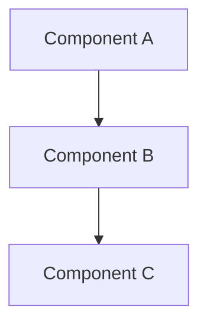

# Design Document

## Overview

[High-level description of the feature and its place in the overall system]

## Steering Document Alignment

### Technical Standards (tech.md)
[How the design follows documented technical patterns and standards]

### Project Structure (structure.md)
[How the implementation will follow project organization conventions]

## Code Reuse Analysis
[What existing code will be leveraged, extended, or integrated with this feature]

### Existing Components to Leverage
- **[Component/Utility Name]**: [How it will be used]
- **[Service/Helper Name]**: [How it will be extended]

### Integration Points
- **[Existing System/API]**: [How the new feature will integrate]
- **[Database/Storage]**: [How data will connect to existing schemas]

## Architecture

[Describe the overall architecture and design patterns used]

### Modular Design Principles
- **Single File Responsibility**: Each file should handle one specific concern or domain
- **Component Isolation**: Create small, focused components rather than large monolithic files
- **Service Layer Separation**: Separate data access, business logic, and presentation layers
- **Utility Modularity**: Break utilities into focused, single-purpose modules



## Components and Interfaces

### Component 1
- **Purpose:** [What this component does]
- **Interfaces:** [Public methods/APIs]
- **Dependencies:** [What it depends on]
- **Reuses:** [Existing components/utilities it builds upon]

### Component 2
- **Purpose:** [What this component does]
- **Interfaces:** [Public methods/APIs]
- **Dependencies:** [What it depends on]
- **Reuses:** [Existing components/utilities it builds upon]

## Data Models

### Model 1
```
[Define the structure of Model1 in your language]
- id: [unique identifier type]
- name: [string/text type]
- [Additional properties as needed]
```

### Model 2
```
[Define the structure of Model2 in your language]
- id: [unique identifier type]
- [Additional properties as needed]
```

## Error Handling

### Error Scenarios
1. **Scenario 1:** [Description]
   - **Handling:** [How to handle]
   - **User Impact:** [What user sees]

2. **Scenario 2:** [Description]
   - **Handling:** [How to handle]
   - **User Impact:** [What user sees]

## Container Architecture

### Application Container
- **Base Image:** [例: rust:1.82-slim, node:22-alpine]
- **Build Strategy:** [multi-stage build / single stage]
- **Exposed Ports:** [例: 3000 (API), 3001 (frontend)]

### Service Dependencies

| Service | Image | Port | Purpose |
|---------|-------|------|---------|
| [DB] | [例: postgres:16-alpine] | [例: 5432] | [Primary database] |
| [Cache] | [例: valkey/valkey:8-alpine] | [例: 6379] | [Cache/Session] |

### docker-compose Structure
[開発用 docker-compose.yml の構成概要。サービス間のネットワーク、ボリューム、環境変数]

### Test Container Strategy

| Service | Strategy | Notes |
|---------|----------|-------|
| DB | testcontainers / docker-compose.test.yml | テストごとにクリーンな DB |
| Cache | testcontainers / in-memory stub | |
| External API | mock server container / trait DI | |

---

## Testing Strategy

> 詳細なテスト仕様（テストケースレベル）は test-design.md に定義する。
> このセクションはテスト戦略の概要のみを記載する。

### Unit Testing
- [ユニットテスト方針の概要]
- [テスト対象の主要コンポーネント]

### Integration Testing
- [統合テスト方針の概要]
- [テスト対象の主要フロー]

### End-to-End Testing
- [E2Eテスト方針の概要]
- [テスト対象のユーザーシナリオ]
