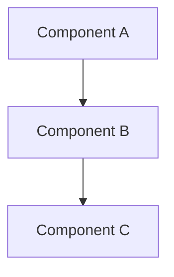

# Design Document

## Overview

[High-level description of the feature and its place in the overall system]

## Steering Document Alignment

### Technical Standards (tech.md)
[How the design follows documented technical patterns and standards]

### Project Structure (structure.md)
[How the implementation will follow project organization conventions]

## Code Reuse Analysis
[What existing code will be leveraged, extended, or integrated with this feature]

### Existing Components to Leverage
- **[Component/Utility Name]**: [How it will be used]
- **[Service/Helper Name]**: [How it will be extended]

### Integration Points
- **[Existing System/API]**: [How the new feature will integrate]
- **[Database/Storage]**: [How data will connect to existing schemas]

## Architecture

[Describe the overall architecture and design patterns used]

### Modular Design Principles
- **Single File Responsibility**: Each file should handle one specific concern or domain
- **Component Isolation**: Create small, focused components rather than large monolithic files
- **Service Layer Separation**: Separate data access, business logic, and presentation layers
- **Utility Modularity**: Break utilities into focused, single-purpose modules


```mermaid
graph TD
    A[Component A] --> B[Component B]
    B --> C[Component C]
```

## Components and Interfaces

### Component 1
- **Purpose:** [What this component does]
- **Interfaces:** [Public methods/APIs]
- **Dependencies:** [What it depends on]
- **Reuses:** [Existing components/utilities it builds upon]

### Component 2
- **Purpose:** [What this component does]
- **Interfaces:** [Public methods/APIs]
- **Dependencies:** [What it depends on]
- **Reuses:** [Existing components/utilities it builds upon]

## Data Models

### Model 1
```
[Define the structure of Model1 in your language]
- id: [unique identifier type]
- name: [string/text type]
- [Additional properties as needed]
```

### Model 2
```
[Define the structure of Model2 in your language]
- id: [unique identifier type]
- [Additional properties as needed]
```

## Error Handling

### Error Scenarios
1. **Scenario 1:** [Description]
   - **Handling:** [How to handle]
   - **User Impact:** [What user sees]

2. **Scenario 2:** [Description]
   - **Handling:** [How to handle]
   - **User Impact:** [What user sees]

## Module Boundaries

プロジェクトのレイヤー構造と依存方向ルールを定義する。

### レイヤー定義

| Layer | Directory | 責務 |
|-------|-----------|------|
| [例: handlers] | [例: src/handlers/] | [例: HTTP リクエスト処理、バリデーション] |
| [例: services] | [例: src/services/] | [例: ビジネスロジック、ドメインルール] |
| [例: infra] | [例: src/infra/] | [例: DB アクセス、外部 API 呼び出し] |

### 依存方向ルール

| From (依存元) | Allowed (許可) | Forbidden (禁止) |
|--------------|---------------|-----------------|
| [例: handlers] | [例: services, infra] | [例: —] |
| [例: services] | [例: infra] | [例: handlers] |
| [例: infra] | [例: —] | [例: handlers, services] |

> **structure.md との整合**: ここで定義したレイヤーは `.spec-workflow/steering/structure.md` の
> Directory Organization および File Placement Rules と一致していること。
> `/generate-arch-tests` を使用するとこの定義に基づくアーキテクチャテストを自動生成できる。

### 共有型定義

モジュール間で共有される型定義の管理方針を定義する。

| 共有型カテゴリ | 配置先 | 管理方法 | 例 |
|--------------|--------|---------|-----|
| [例: API リクエスト/レスポンス型] | [例: src/types/ or src/models/] | [例: 手動定義、OpenAPI から生成] | [例: CreateUserRequest] |
| [例: DB モデル型] | [例: src/models/] | [例: ORM schema から derive] | [例: User, Post] |
| [例: 共有ドメイン型] | [例: src/domain/] | [例: 手動定義] | [例: UserId, Email] |
| [例: フロントエンド↔バックエンド共有型] | [例: shared/types/] | [例: 手動定義 or 型生成ツール] | [例: ApiResponse<T>] |

**型共有の原則:**
- 共有型は依存方向ルールの最下層に配置し、全レイヤーからアクセス可能にする
- API 境界の型は OpenAPI 定義（`/generate-api-docs`）と整合させる
- 型の重複定義を避け、単一の定義元（Single Source of Truth）を維持する

> **P5-06 対応**: このテーブルが埋められていることで、モジュール間の型定義が管理されていることを示す。

## Container Architecture

### Application Container
- **Base Image:** [例: rust:1.93-slim, node:24-alpine]
- **Build Strategy:** [multi-stage build / single stage]
- **Exposed Ports:** [例: 3000 (API), 3001 (frontend)]

### Service Dependencies

| Service | Image | Port | Purpose |
|---------|-------|------|---------|
| [DB] | [例: postgres:16-alpine] | [例: 5432] | [Primary database] |
| [Cache] | [例: valkey/valkey:8-alpine] | [例: 6379] | [Cache/Session] |

### docker-compose Structure
[開発用 docker-compose.yml の構成概要。サービス間のネットワーク、ボリューム、環境変数]

### Test Container Strategy

| Service | Strategy | Notes |
|---------|----------|-------|
| DB | testcontainers / docker-compose.test.yml | テストごとにクリーンな DB |
| Cache | testcontainers / in-memory stub | |
| External API | mock server container / trait DI | |

## Required Build Tools

| Tool | Min Version | Purpose | Check Command | Install Command | Required |
|------|-------------|---------|---------------|-----------------|----------|
| [例: cargo] | [例: >= 1.93] | [例: Rust build system] | [例: cargo --version] | [例: rustup update] | Yes |
| [例: docker] | [例: >= 29.0] | [例: Container runtime] | [例: docker --version] | [例: apt install docker.io] | Yes |
| [例: docker compose] | [例: >= 5.1] | [例: Compose-based local/dev orchestration] | [例: docker compose version] | [例: apt install docker-compose-plugin] | Yes |
| [例: sccache] | [例: any] | [例: Build cache] | [例: sccache --version] | [例: cargo install sccache] | Recommended |

Notes:
- **Yes**: 実装開始前に必須。未インストール = FAIL。実装を停止しユーザーに報告
- **Recommended**: 未インストールでも警告のみで続行可能
- プロジェクトで docker-compose / docker compose を使用する場合は、**必ず本テーブルに Required=Yes として記載**すること（quality-checks / スモークテストでの環境要件と整合させるため）
- **Version Verification**: Min Version は AI の学習データのデフォルト値を使用しない。WebSearch、各レジストリの対象パッケージページ（例: crates.io の該当 crate ページ）、または対象名の完全一致が確認できるレジストリ CLI（例: `npm view {pkg} version`）で最新安定版を確認し反映すること（Phase 2 step 3.5 参照）
- **Container Image Consistency**: Base Image のタグ（例: `rust:X.YZ-slim`）は Required Build Tools の Min Version と一致させること

## Excluded Test Environments

> このセクションは、特定のテストが実行不可能な場合に **設計時に明示的に除外宣言** するためのセクションです。
> `test-design.md` にテスト仕様が定義されているテストは、ここで明示的に除外宣言されていない限り、すべて実装フェーズで実行必須です。
> 環境がない、サーバー起動が必要、Chrome が必要 等の理由は、Required Tools（design.md の Required Build Tools / test-design.md の Required Test Tools）で対応すべきであり、除外理由にはなりません。

| Test Category | Excluded Tests | Reason | Alternative Verification |
|--------------|---------------|--------|------------------------|
| [例: E2E] | [例: E2E-3 (iOS Safari 検証)] | [例: CI に iOS デバイスがない] | [例: BrowserStack で手動検証] |

除外が許可される理由の例:
- 特殊ハードウェア依存（GPU, IoT デバイス, 特定OS等）
- 外部サービスの本番環境でのみ検証可能（サンドボックスが存在しない）
- ライセンス制約のあるツール

除外が **許可されない** 理由:
- Docker/コンテナランタイムが未インストール（→ Required Build Tools で対応）
- Chrome/ブラウザが未インストール（→ test-design.md の Required Test Tools で対応）
- サーバー起動が必要（→ docker-compose / Required Build Tools で対応）
- データベースが必要（→ testcontainers / docker-compose で対応）

---

## Testing Strategy

> 詳細なテスト仕様（テストケースレベル）は test-design.md に定義する。
> このセクションはテスト戦略の概要のみを記載する。

### Unit Testing
- [ユニットテスト方針の概要]
- [テスト対象の主要コンポーネント]

### Integration Testing
- [統合テスト方針の概要]
- [テスト対象の主要フロー]

### End-to-End Testing
- [E2Eテスト方針の概要]
- [テスト対象のユーザーシナリオ]
